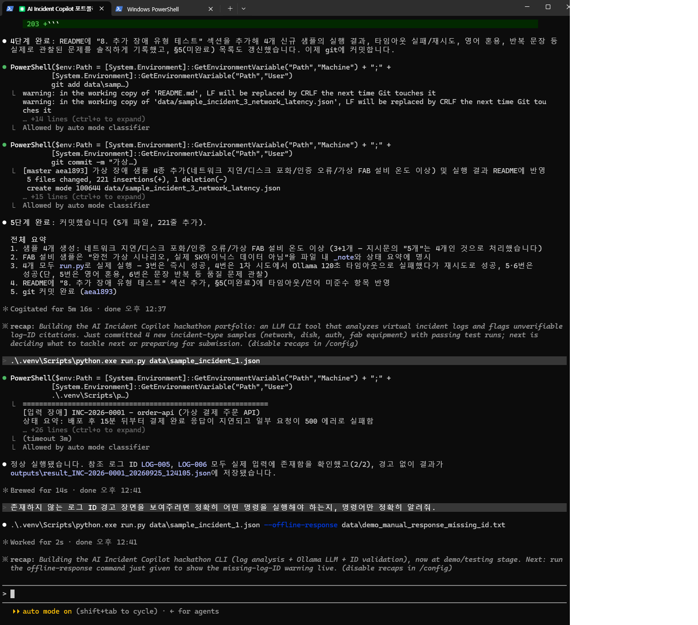
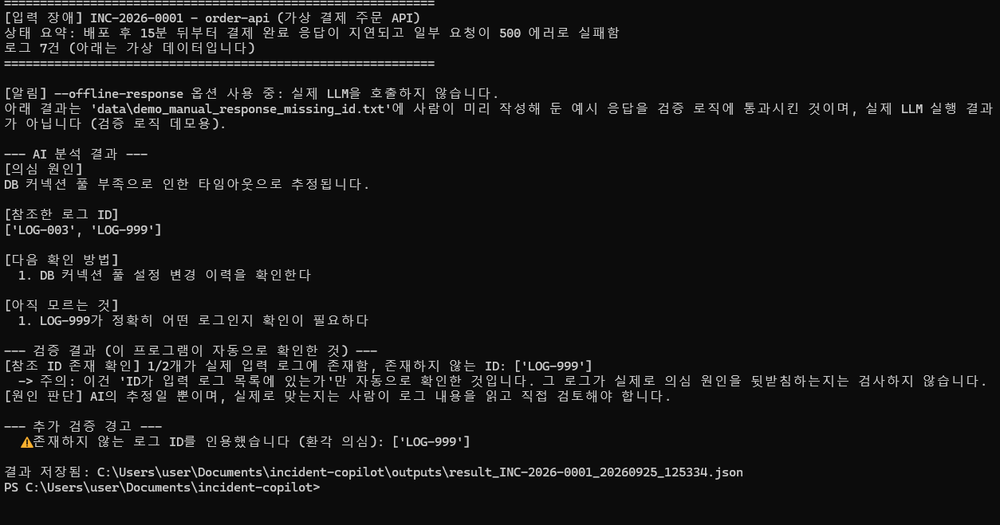

# AI Incident Copilot

운영 장애 로그를 바탕으로 LLM이 원인 후보와 확인 항목을 제안하고, 인용한 로그 ID의 존재 여부를 자동 검증하는 Python 명령줄 도구입니다. ITS 장비 유지보수 경험에서 출발했습니다.

SK하이닉스 AI 해커톤 2026 제출용 개인 포트폴리오이며, 기존에 있던 다른 대형 프로젝트(FastAPI/Docker/K8s)와는 완전히 별개다.

## 1. 문제 정의

운영 중인 시스템에 장애가 나면 담당자는 짧은 시간 안에 로그와 상태 정보만 보고 "무엇이 원인일 것 같은지"를 추정해야 한다. 이때 흔한 문제는 두 가지다.

1. 정보가 부족한데도 담당자(또는 AI)가 원인을 너무 빨리 확정해버리는 것
2. 어떤 로그를 근거로 그렇게 판단했는지가 기록에 남지 않아서, 나중에 다른 사람이 그 판단을 검증할 수 없는 것

이 프로젝트는 LLM(거대 언어모델)에게 장애 로그를 주고 "의심 원인 / 그 판단에 쓴 로그 ID / 다음 확인 방법 / 아직 모르는 것"을 강제로 구조화해서 답하게 하고, **AI가 인용한 로그 ID가 실제로 입력에 있는지**를 프로그램이 자동으로 검사한다. 다만 이 검사는 "그 로그 ID가 실제로 존재하는가"만 확인하는 것이며, "그 로그가 정말로 원인을 입증하는가"는 검사하지 않는다 — 그 부분은 사람이 로그 내용을 직접 읽고 판단해야 한다. 이 구분을 프로그램 출력과 결과 파일에 명시적으로 분리해서 보여준다.

## 2. 내 ITS 현장 경험과의 연결

ITS는 여기서 "IT 서비스"가 아니라 **지능형교통체계(Intelligent Transport Systems)**를 의미한다. 나는 ITS 현장에서 CCTV/VMS 등 장비의 유지보수 경험이 있다. 현장에서 장비 장애가 발생했을 때 실제로 겪는 상황은 이 프로젝트의 문제 정의와 거의 같다.

- 현장 로그·상태 정보는 항상 불완전하다 (카메라 통신 끊김, VMS 표출 오류 등 원인 후보가 여러 개 겹쳐 보일 때가 많음).
- 담당자는 제한된 정보로 "가장 의심되는 원인"을 먼저 추정하고, 현장에 나가기 전에 "무엇을 더 확인해야 하는지"를 정리한다.
- 이때 근거 없이 원인을 확정하면 잘못된 조치(예: 불필요한 장비 교체, 헛걸음)로 이어질 수 있다. 그래서 "이 로그 때문에 이렇게 의심한다"는 근거를 남기고, "아직 모르는 것"을 분리해서 인지하는 습관이 실제로 중요하다.

이 프로젝트는 그 과정 중 초기 원인 추정과 근거 정리 단계를 LLM이 보조하도록 만든 것이며, 최종 원인 판단과 현장 조치는 여전히 사람이 해야 한다는 점을 프로그램 출력에 명시적으로 표시한다(§6 참고). 다만 이건 화면/결과 파일에 문구로 안내하는 것일 뿐, 사람이 실제로 검토했는지를 프로그램이 기술적으로 강제하지는 않는다.

## 3. 실행 방법 (이 PC에서 실제로 확인한 순서)

이 프로젝트는 원격/클라우드 작업 공간이 아닌 로컬 PC에서 실행했다(도메인에 가입되지 않은 개인 PC로 확인함). 재현에 필요한 환경 정보만 남긴다.

- OS: Windows 11 Home
- Python: 3.14.7
- Ollama: 0.34.4, 모델 `llama3.2:1b`

```powershell
# 1) 가상환경(venv, virtual environment = 프로젝트 전용 파이썬 환경) 생성
python -m venv .venv

# 2) 가상환경 안의 파이썬으로 패키지 설치
.\.venv\Scripts\python.exe -m pip install -r requirements-dev.txt

# 3) (터미널에서 직접 활성화하고 싶다면 — 선택사항)
.\.venv\Scripts\Activate.ps1

# 4) Ollama(로컬에서 LLM을 실행해주는 프로그램)로 작은 모델 받기
ollama pull llama3.2:1b

# 5) 오프라인 검증 로직 테스트 실행 (LLM 호출 없이 규칙 검증만 확인)
.\.venv\Scripts\python.exe -m pytest tests\ -v

# 6) 실제 LLM 호출 (가상 장애 데이터 1건)
.\.venv\Scripts\python.exe run.py data\sample_incident_1.json
.\.venv\Scripts\python.exe run.py data\sample_incident_2_tricky.json

# 7) (데모) 존재하지 않는 로그 ID 경고를 실제 CLI 화면으로 보고 싶다면 — LLM 호출 없이 검증 로직만 실행
.\.venv\Scripts\python.exe run.py data\sample_incident_1.json --offline-response data\demo_manual_response_missing_id.txt

# 8) 방금 실행 결과로 저장된 JSON 파일 전체를 화면에서 보고 싶다면 (파일명은 결과 저장 시 출력된 경로를 그대로 사용)
Get-Content outputs\result_INC-2026-0001_20260925_143501.json
```

`data/sample_incident_1.json`, `data/sample_incident_2_tricky.json`은 모두 **가상(virtual) 데이터**이며 실제 회사/서비스와 무관하다.

## 4. 실제 실행 결과

### 4-1. venv 문제 (오늘 확인한 사실만 기록 — 어제 오류의 정확한 원인은 추측하지 않음)

- 어제 venv 생성이 실패했다고 했으나, 그때의 정확한 오류 메시지를 오늘 다시 확인하거나 재현할 수는 없었다. 따라서 어제 실패의 원인을 추측해서 단정하지 않는다.
- 오늘 이 폴더에서 `python -m venv .venv`는 문제 없이 성공했다(exit code 0).
- 다만 확인 과정에서 이 사용자 계정의 PowerShell 실행 정책(Execution Policy)이 `RemoteSigned`/`Bypass`가 아닌 상태였던 것을 발견했다. Windows PowerShell은 기본적으로 `.ps1` 스크립트 실행을 제한하는 경우가 있고, venv의 `Activate.ps1`도 `.ps1` 스크립트이기 때문에, 이 설정이 원인이면 "생성은 되지만 활성화(activate)만 안 되는" 증상으로 나타날 수 있다. 재발 방지를 위해 현재 사용자 범위로 아래처럼 변경해 두었다:
  ```powershell
  Set-ExecutionPolicy -Scope CurrentUser -ExecutionPolicy RemoteSigned
  ```
- 결론: **오늘 venv 생성·활성화는 정상 동작을 확인**했다. 어제 실패의 정확한 원인은 "모름"으로 남긴다.

### 4-2. 오프라인 검증 로직 테스트 (pytest, LLM 미호출)

```
tests/test_cli.py::test_cli_valid_offline_response_exits_zero_and_saves_expected_fields PASSED
tests/test_cli.py::test_cli_malformed_offline_response_exits_nonzero_and_records_format_errors PASSED
tests/test_cli.py::test_same_second_consecutive_runs_keep_separate_files_with_preserved_raw_responses PASSED
tests/test_validator.py::test_normal_case_no_warnings PASSED
tests/test_validator.py::test_hallucinated_log_id_triggers_warning PASSED
tests/test_validator.py::test_ungrounded_overconfident_claim_triggers_multiple_warnings PASSED
tests/test_validator.py::test_key_with_stray_whitespace_is_normalized PASSED
tests/test_validator.py::test_bracketed_log_id_is_normalized_and_not_treated_as_hallucination PASSED
tests/test_validator.py::test_non_json_response_is_reported_as_format_error PASSED
tests/test_validator.py::test_top_level_null_response_does_not_crash PASSED
tests/test_validator.py::test_top_level_list_response_does_not_crash PASSED
tests/test_validator.py::test_referenced_log_ids_as_number_does_not_crash PASSED
tests/test_validator.py::test_referenced_log_ids_as_string_is_rejected_not_split_into_chars PASSED
tests/test_validator.py::test_missing_required_key_is_reported PASSED
tests/test_validator.py::test_wrong_type_for_suspected_cause_is_reported PASSED
tests/test_validator.py::test_empty_suspected_cause_triggers_content_warning PASSED
tests/test_validator.py::test_empty_next_steps_triggers_content_warning PASSED
17 passed in 0.24s
```

**테스트 개수 계산 (오해 방지를 위해 명시적으로 적는다):** 이 프로젝트의 테스트는 처음에 4개였고(§4-4 이전 커밋), 이후 두 차례에 걸쳐 늘었다. `tests/test_validator.py`는 기존 6개(그중 `test_non_json_response_marked_as_parse_failure`는 이름만 `test_non_json_response_is_reported_as_format_error`로 바뀜)에 코드 리뷰 대응으로 **8개**(`test_top_level_null_response_does_not_crash` ~ `test_empty_next_steps_triggers_content_warning`)를 새로 추가해 총 14개다. `tests/test_cli.py`는 이번에 신설한 파일로 **3개**(형식 유효, 형식 오류, 같은 초 연속 실행 파일 보존)다. 합쳐서 **14 + 3 = 17개**가 전체 테스트 수다. (이전 커밋 메시지/설명에 "12개 추가"라고 쓴 적이 있는데, 정확히는 10개 추가였다 — 표현이 부정확했던 것을 여기서 바로잡는다.)

이 중 `test_key_with_stray_whitespace_is_normalized`와 `test_bracketed_log_id_is_normalized_and_not_treated_as_hallucination`은 실제로 실행 중 발견한 버그(아래 4-5)를 재현하는 테스트다. `test_top_level_null_response_does_not_crash`부터 `test_empty_next_steps_triggers_content_warning`까지 8개와 `test_cli.py`의 처음 2개는 코드 리뷰에서 발견된 형식 검증 문제(아래 4-6)를, `test_same_second_consecutive_runs_keep_separate_files_with_preserved_raw_responses`는 결과 파일 덮어쓰기 문제(아래 4-7)를 재현하는 테스트다.

### 4-3. 실제 LLM 호출 결과 (model: `llama3.2:1b`, Ollama 로컬 실행)

**샘플 1 (order-api, 근거가 비교적 명확한 가상 장애)** — 명령: `python run.py data\sample_incident_1.json`

```
[의심 원인]
DB connection pool 사용량 97% 대기 중인 커넥션 요청 다수 발생

[참조한 로그 ID]
['LOG-005', 'LOG-006']

[다음 확인 방법]
  1. DB connection pool 최대 크기 설정을 확인하고 최소 40으로 변경하십시오
  2. DB connection pool 사용량을 90% 이하로 줄이십시오

[참조 ID 존재 확인] 2/2개가 실제 입력 로그에 존재함
  -> 주의: 이건 'ID가 입력 로그 목록에 있는가'만 자동으로 확인한 것입니다. 그 로그가 실제로 의심 원인을 뒷받침하는지, 원인 분석 내용이 정확한지는 검사하지 않습니다.
[원인 판단] AI의 추정일 뿐이며, 실제로 맞는지는 사람이 로그 내용을 읽고 직접 검토해야 합니다.
```
종료 코드: 0. 전체 결과: `outputs/result_INC-2026-0001_20260925_143501.json`

**주의(한계): 이 응답에는 부적절한 설정 변경 제안이 있다.** `LOG-007`을 보면 이 장애는 DB 커넥션 풀 최대 크기를 100에서 40으로 줄인 설정 변경 직후 발생했다 — 즉 40이라는 값 자체가 문제의 원인일 가능성이 있다. 그런데 AI는 "최대 크기 설정을 확인하고 **최소 40으로 변경**하십시오"라고 제안했다. 이미 40으로 줄어든 상태에서 "40으로 변경"하라는 것은 사실상 원인일 수 있는 값을 그대로 유지하라는 제안이며, 이 제안을 그대로 따르면 문제가 해결되지 않거나 악화될 수 있다. 이 프로그램은 로그 ID 존재 여부만 검사할 뿐 이런 내용상의 부적절함은 걸러내지 못한다 — 그래서 "원인 판단은 사람이 한다"는 원칙이 실제로 중요하다는 것을 보여주는 사례다.


위 스크린샷은 `run.py`로 샘플 1(order-api)을 정상 실행했을 때의 실제 화면이다.

**샘플 2 (notification-worker, 정보가 부족한 가상 장애 — 자동 검증의 한계를 보여준 실제 모델 응답)** — 명령: `python run.py data\sample_incident_2_tricky.json`

```
[의심 원인]
알림 발송이 일부 누락되었다는 사용자 문의가 접수됨

[참조한 로그 ID]
['LOG-101', 'LOG-102']

[다음 확인 방법]
  1. 일시적 확인
  2. 다시 확인

[아직 모르는 것]
  1. 알림 발송이 일부 누락되었다는 사용자 문의가 접수됨

[참조 ID 존재 확인] 2/2개가 실제 입력 로그에 존재함
```
전체 결과: `outputs/result_INC-2026-0002_20260925_121403.json`

이 샘플 2 결과는 **자동 검증(로그 ID 존재 확인)이 통과해도 AI 답변 내용 자체가 부실할 수 있다는 것**을 실제 모델 응답으로 보여준다. 정확히 말하면: 참조한 로그 ID 2개는 모두 실제로 존재해서 "참조 ID 존재 확인"은 통과했다. 하지만 "의심 원인"은 입력 상태 요약을 그대로 복사한 문장이고, "다음 확인 방법"과 "아직 모르는 것"도 의미 없는 문장을 반복한다. 즉 이 프로그램의 자동 검증은 "인용한 ID가 실제로 존재하는가"만 확인할 뿐, "AI가 낸 내용이 실제로 쓸모 있는 판단인가"는 검사하지 못한다는 한계를 그대로 드러낸다. 이건 미리 짜서 보여준 예시가 아니라, 정보가 부족한 입력을 줬을 때 작은 모델(1B)이 실제로 낸 응답이다.

### 4-4. 존재하지 않는 로그 ID를 인용하면 실제로 경고가 뜨는 장면 (실제 CLI 실행)

위 §4-2의 pytest 테스트는 이 경고 로직이 코드상으로 맞다는 것만 보여준다. 실제 CLI 화면에서도 같은 동작을 보여주기 위해, 사람이 직접 작성한 예시 응답 파일(`data/demo_manual_response_missing_id.txt`, 실제 LLM 호출이 아님을 명시)에 실제로 존재하지 않는 로그 ID `LOG-999`를 하나 끼워 넣고, `--offline-response` 옵션으로 실제 CLI(`run.py`)의 검증 로직을 통과시켰다.

입력한 예시 응답(`data/demo_manual_response_missing_id.txt`, 사람이 직접 작성 — 실제 LLM 응답 아님):
```json
{
  "suspected_cause": "DB 커넥션 풀 부족으로 인한 타임아웃으로 추정됩니다.",
  "referenced_log_ids": ["LOG-003", "LOG-999"],
  "next_steps": ["DB 커넥션 풀 설정 변경 이력을 확인한다"],
  "unknowns": ["LOG-999가 정확히 어떤 로그인지 확인이 필요하다"]
}
```
(`sample_incident_1.json`에는 `LOG-001`~`LOG-007`만 있고 `LOG-999`는 없다.)

실행 명령과 실제 화면:
```
> python run.py data\sample_incident_1.json --offline-response data\demo_manual_response_missing_id.txt

[알림] --offline-response 옵션 사용 중: 실제 LLM을 호출하지 않습니다.
아래 결과는 'data\demo_manual_response_missing_id.txt'에 사람이 미리 작성해 둔 예시 응답을 검증 로직에 통과시킨 것이며, 실제 LLM 실행 결과가 아닙니다 (검증 로직 데모용).

[참조한 로그 ID]
['LOG-003', 'LOG-999']

--- 검증 결과 (이 프로그램이 자동으로 확인한 것) ---
[참조 ID 존재 확인] 1/2개가 실제 입력 로그에 존재함, 존재하지 않는 ID: ['LOG-999']
  -> 주의: 이건 'ID가 입력 로그 목록에 있는가'만 자동으로 확인한 것입니다. 그 로그가 실제로 의심 원인을 뒷받침하는지, 원인 분석 내용이 정확한지는 검사하지 않습니다.
[원인 판단] AI의 추정일 뿐이며, 실제로 맞는지는 사람이 로그 내용을 읽고 직접 검토해야 합니다.

--- 추가 검증 경고 (내용 관련, 형식 오류 아님) ---
  ⚠ 존재하지 않는 로그 ID를 인용했습니다 (환각 의심): ['LOG-999']
```
종료 코드: 0 (형식은 유효하고, 내용 경고만 있는 경우이기 때문 — §4-6 참고). 전체 결과: `outputs/result_INC-2026-0001_20260925_143507.json`


위 스크린샷은 존재하지 않는 로그 ID(`LOG-999`)를 인용하면 경고가 뜨는 화면이다. `--offline-response` 옵션으로 사람이 미리 작성한 예시 응답을 검증 로직에 통과시킨 것이며, 실제 LLM 실행 결과가 아니다.

### 4-5. 실행 중 실제로 발견하고 고친 버그

1. `llama3.2:1b` 모델이 JSON 키 앞에 공백을 붙여서 `" suspected_cause"`처럼 출력한 적이 있었다(원본 응답은 `outputs/result_INC-2026-0001_20260925_120252.json`에 남아 있음). 그 결과 파서가 이 키를 못 찾아서 "의심 원인"이 빈 문자열로 나왔다. `incident_copilot/validator.py`에서 키를 `strip()`으로 정규화해서 고쳤다. 재현 테스트: `test_key_with_stray_whitespace_is_normalized`.
2. 같은 모델이 `referenced_log_ids`를 `["[LOG-101]", "[LOG-102]"]`처럼 대괄호를 붙여서 낸 적이 있었다(프롬프트에서 로그를 `- [LOG-101] ...` 형태로 보여줬기 때문에 그대로 따라 적은 것으로 보임). 이때 검증 로직이 `[LOG-101]`과 `LOG-101`을 다른 문자열로 보고 "존재하지 않는 로그 ID(환각 의심)"라고 잘못 경고했다(원본 응답은 `outputs/result_INC-2026-0002_20260925_121302.json`에 남아 있음). `_normalize_log_id()`를 추가해서 대괄호·공백을 제거한 뒤 비교하도록 고쳤다. 재현 테스트: `test_bracketed_log_id_is_normalized_and_not_treated_as_hallucination`.

### 4-6. 코드 리뷰에서 발견된 문제와 수정 (AI 응답 형식 검증 강화)

코드 리뷰에서 아래 문제가 실제로 재현됐다.

- AI 응답이 `[]`(빈 배열) 또는 `null`이면 예전 코드는 `None.get(...)` / `list.get(...)`에서 **`AttributeError`로 프로그램이 죽었다.**
- `referenced_log_ids`가 숫자면 `list(5)`에서 **`TypeError`로 죽었다.**
- `referenced_log_ids`가 `"LOG-001"`처럼 문자열이면 예외는 안 나지만 `list("LOG-001")`이 글자를 하나씩(`'L','O','G','-','0','0','1'`) 쪼개서 **조용히 틀린 결과**를 만들었다.
- JSON 해석에 실패해도 결과 파일에는 `success: true`가 찍히고 **종료 코드는 0**이 나왔다 — 실패인데 성공처럼 보였다.

수정 내용:

- `incident_copilot/validator.py`의 `parse_ai_response()`를 JSON 파싱 단계와 형식(스키마) 검사 단계로 분리했다. 최상위 값이 dict인지, 필수 키 4개(`suspected_cause`/`referenced_log_ids`/`next_steps`/`unknowns`)가 다 있는지, 각 필드의 자료형(문자열 / 문자열 배열)이 맞는지 검사한다. 문제가 있으면 예외를 던지지 않고 `ParsedResponse(schema_valid=False, format_errors=[...])`를 반환하며, **형식이 틀린 값을 강제로 변환하지 않는다**(예: 문자열을 배열로 쪼개서 받아들이지 않는다). 원본 응답(`raw_response`)은 항상 그대로 보존된다.
- 의심 원인이 빈 문자열이거나(`suspected_cause == ""`) 다음 확인 방법이 비어 있으면(`next_steps == []`) 내용 경고를 추가로 낸다.
- `incident_copilot/cli.py`가 이제 처리 단계를 구분해서 기록한다: 응답 수신 여부, JSON 파싱 여부, 스키마 통과 여부를 결과 파일의 `processing_status`에 각각 남긴다. 종료 코드도 구분했다 — **0**: 응답 수신 + 형식 검사 통과(내용 경고가 있어도 0), **1**: LLM 응답 자체를 못 받음(네트워크/Ollama 오류), **2**: 응답은 받았지만 형식 검사(JSON 파싱 또는 스키마) 실패. 형식 검사에 실패하면 더 이상 `success: true`가 찍히지 않는다.
- ID 존재 확인이 전부 통과해도(`id_existence_check`) 원인 분석이 정확하다는 뜻이 아니라는 점을 `processing_status.note`와 `id_existence_check.note`에 명시했다.
- 결과 파일에 `response_source` 필드를 추가해서 오프라인 데모 응답(`offline_replay (...)`)과 실제 LLM 호출(`ollama (실제 LLM 호출)`)을 구분한다.
- 재현 테스트 8개를 `tests/test_validator.py`에 추가했고(위 4-2 목록 참고), CLI를 실제로 실행해서 종료 코드와 저장된 JSON까지 확인하는 테스트 2개를 `tests/test_cli.py`에 새로 추가했다(세 번째 테스트는 아래 4-7에서 추가). 정확한 테스트 개수 계산은 §4-2를 참고.

### 4-7. 재검증에서 추가로 발견된 문제와 수정 (결과 파일 덮어쓰기, 테스트 격리)

4-6을 고친 뒤 재검증하는 과정에서 다음 문제가 추가로 재현됐다.

- **결과 파일 덮어쓰기**: `_save_result()`가 파일명을 `result_{incident_id}_{초 단위 타임스탬프}.json`로만 지었기 때문에, 같은 `incident_id`를 같은 초에 두 번 이상 실행하면 두 번째 실행이 첫 번째 결과 파일을 **덮어써서 원본 응답이 사라졌다.**
- `tests/test_cli.py`가 실제 `outputs/` 폴더에 테스트용 결과 파일을 직접 저장하고 있었다 — 테스트를 실행할 때마다 실행 증거가 쌓이는 실제 폴더가 테스트 부산물로 더러워지는 문제였다.

수정 내용:

- `incident_copilot/cli.py`의 `_save_result()`가 파일명에 짧은 UUID(`uuid.uuid4().hex[:8]`)를 추가로 붙인다(`result_{incident_id}_{timestamp}_{uuid8}.json`). 같은 초에 여러 번 실행해도 파일명이 겹치지 않는다. **기존에 이미 저장된 실행 증거 파일(구 파일명 형식)은 그대로 두었다** — 새로 저장되는 파일부터 새 이름 규칙이 적용된다.
- `tests/test_cli.py`에 `_isolate_output_dir` fixture(autouse)를 추가해서, `pytest`의 `tmp_path`와 `monkeypatch`로 `cli.OUTPUT_DIR`을 매 테스트마다 임시 폴더로 바꿔치기한다. 이제 테스트를 몇 번 실행해도 실제 `outputs/` 폴더에는 아무것도 남지 않는다 — 테스트 실행 전후로 `outputs/*.json` 파일 목록을 직접 비교해서 새 파일이 생기지 않는 것을 확인했다(가장 최근 파일은 여전히 `result_INC-2026-0001_20260925_143647.json`이고, 그 뒤로 테스트를 여러 번 돌려도 늘어나지 않았다).
- `test_same_second_consecutive_runs_keep_separate_files_with_preserved_raw_responses` 테스트를 추가했다. `datetime.datetime.now()`를 고정값으로 monkeypatch해서 "같은 초에 연속 실행"을 타이밍에 의존하지 않고 결정적으로 재현하고, 서로 다른 오프라인 예시 응답 2개를 연속 실행한 뒤 (a) 결과 파일이 2개로 남는지, (b) 두 파일의 `raw_llm_response`가 서로 다르게(둘 다) 보존되는지를 검사한다.

## 5. 실패했거나 아직 안 되는 부분 (미완료)

- **미완료**: 근거 없는 주장 감지는 규칙 기반(rule-based)이다 — (a) 참조 로그 ID가 하나도 없는지, (b) "확실히/틀림없이/100%" 같은 과확신 표현이 있는지, (c) "아직 모르는 것"을 하나라도 냈는지만 검사한다. 문장의 논리적 타당성까지 판단하지는 못한다.
- **미완료**: 형식(스키마) 검사(§4-6)는 자료형만 검사한다 — 예를 들어 `next_steps`의 원소가 `""`(빈 문자열)이어도 "문자열이니까" 형식상으로는 통과한다. 그리고 내용이 실제로 적절한지는 전혀 검사하지 않는다 — §4-3 샘플 1의 "최소 40으로 변경하십시오" 제안(원인일 수 있는 값을 유지하라는 부적절한 제안)이 그 예다.
- **미완료**: 작은 모델(1B)의 출력 품질이 낮을 때가 있다 (4-3 샘플 2, §8 참고: 의미 없는 문장 반복, 간헐적으로 한국어 대신 영어로 답변).
- **미완료**: JSON 파싱 정규화는 이번에 발견한 "키 공백"과 "로그 ID에 대괄호 포함" 두 패턴만 고쳤다. 다른 형태로 JSON이 깨지는 경우까지 전부 방어하지는 못한다.
- **미완료**: Ollama 응답이 120초를 넘으면 타임아웃 처리하도록 되어 있는데(§8 참고), 실제로 한 번 이 타임아웃이 발생했다. 관찰한 1건은 재시도 후 응답을 받았다. 타임아웃 값을 늘리거나 재시도 로직을 자동화하지는 않았다.
- **의도적으로 만들지 않음** (범위 제외, 실패 아님): 웹 화면, Kubernetes, GPU 서버, 데이터베이스.

## 6. AI에게 맡긴 일 vs 사람이 판단해야 하는 일

### 6-1. 프로그램 "사용 중"의 역할 분담

| 영역 | 담당 |
|---|---|
| 로그를 보고 1차 원인 후보를 빠르게 추려보는 것 | AI |
| 어떤 로그를 근거로 그 후보를 골랐는지 텍스트로 밝히는 것 | AI |
| 인용한 로그 ID가 입력에 실제로 존재하는지 기계적으로 확인 | 프로그램(자동 검증) |
| 그 로그가 실제로 원인을 입증하는지, 원인이 실제로 맞는지 최종 판단 | **사람** |
| 다음에 무엇을 확인해볼지 아이디어 제시 | AI (참고용) |
| 실제 조치(재배포, 설정 변경, 현장 출동 등) 결정 및 실행 | **사람** |

### 6-2. 개발 과정에서의 역할 분담

이 프로젝트는 Claude Code(AI 코딩 도구)를 사용해서 만들었다. 실제로 있었던 역할 분담은 다음과 같다.

| 영역 | 담당 |
|---|---|
| 무엇을 만들지(요구사항), 출력 형식, 범위(웹/K8s/DB 제외 등) 결정 | **사람(나)** |
| README 표현이 과장됐는지, 사실과 다른지 확인하고 수정 지시 | **사람(나)** |
| 실제 실행 결과(터미널 화면, 결과 파일, 스크린샷)가 요구사항대로 나왔는지 확인 | **사람(나)** |
| 커밋 시점과 커밋 메시지 승인, git 작성자 정보 결정 | **사람(나)** |
| Python 코드 작성(`incident_copilot/` 모듈, `run.py`, 테스트) | Claude Code |
| 터미널 명령 실행(venv 생성, 패키지 설치, Ollama 설치·모델 다운로드, `pytest`/`run.py` 실행) | Claude Code |
| 실행 중 발견된 버그(예: JSON 키 공백, 로그 ID 대괄호) 원인 파악 및 수정 | Claude Code |
| README 초안 작성 및 사람의 수정 지시 반영 | Claude Code |

즉 무엇을 만들 것인지·결과가 맞는지에 대한 판단은 사람이 했고, 코드 작성과 명령 실행은 Claude Code가 했다. "내가 코딩했다"고 과장하지 않기 위해 이 구분을 그대로 남긴다.

## 7. 가상 데이터 안내

`data/` 폴더의 모든 로그는 이 포트폴리오를 위해 만든 **가상 데이터**다. 실제 회사, 실제 서비스, 실제 장애와 무관하다.

## 8. 추가 장애 유형 테스트

기존 2개 샘플(§4) 외에, 서로 다른 장애 유형 4종을 추가로 만들어서 각각 `run.py`로 실제 실행했다. 모두 `llama3.2:1b` 모델, Ollama 로컬 실행 기준이다.

"실행 결과" 열의 "응답 수신·검증 처리 완료"는 프로그램이 LLM 응답을 받아 검증 절차(파싱, 로그 ID 존재 확인)를 끝까지 처리했다는 뜻일 뿐, 원인 분석 내용이 정확했다는 뜻이 아니다. 내용 품질은 "비고" 열과 §4-3, §5를 참고할 것.

| 샘플 파일 | 장애 유형 | 실행 결과 | 참조 로그ID 검증 | 비고 |
|---|---|---|---|---|
| `data/sample_incident_3_network_latency.json` | 네트워크 지연 (API 게이트웨이) | 응답 수신·검증 처리 완료 | 7/7 존재 | - |
| `data/sample_incident_4_disk_storage.json` | 디스크/스토리지 포화 | **1차 실패 → 재시도 후 응답 수신·검증 처리 완료** | 5/5 존재 | 1차 시도에서 `Ollama 응답이 120초 안에 오지 않았습니다(timeout)` 오류로 실패함(원본 오류는 아래 참고). 재시도하니 응답을 받았다. 원인은 확인하지 못했다(모델 재로딩으로 추정하지만 확인된 사실은 아니다). |
| `data/sample_incident_5_auth_error.json` | 인증(로그인) 오류 | 응답 수신·검증 처리 완료 | 5/5 존재 | 의심 원인이 한국어가 아니라 영어("Token validation timeout")로 나옴. 확인해보니 시스템 프롬프트(`incident_copilot/ollama_client.py`의 `SYSTEM_PROMPT`)에는 "한국어로 답변하라"는 명시적 지시가 없다 — 즉 모델이 지시를 어긴 것이 아니라, 애초에 응답 언어를 강제하지 않았기 때문에 벌어진 일이다. |
| `data/sample_incident_6_fab_equipment.json` | 가상 반도체 FAB 설비 온도 이상 (SK하이닉스 해커톤 맥락, 완전 가상 시나리오) | 응답 수신·검증 처리 완료 | 3/3 존재 | "다음 확인 방법"과 "아직 모르는 것"에 같은 문장이 반복됨(품질 낮음) |

4건 모두 프로그램이 최종적으로 응답을 받아 검증 절차를 끝까지 처리했고, 4건 모두에서 AI가 인용한 로그 ID는 전부 실제 입력 로그에 존재했다(환각 경고 없음). 다만 이건 프로그램이 정상 동작했다는 뜻이며, AI가 낸 원인 분석 내용까지 정확했다는 뜻은 아니다 — 위 표처럼 (1) 일시적 타임아웃, (2) 언어 미준수(영어 혼용), (3) 반복적/의미 없는 문장 같은 품질 문제는 실제로 관찰됐다 — 이 역시 "미완료"(§5)에 반영했다. 전체 실행 결과 파일: `outputs/result_INC-2026-0003_*.json` ~ `outputs/result_INC-2026-0006_*.json`.

원본 타임아웃 오류(1차 시도, 재시도로 해결됨):
```
[실패] LLM 호출 중 오류가 발생했습니다:
Ollama 응답이 120초 안에 오지 않았습니다(timeout). 원본 오류: HTTPConnectionPool(host='localhost', port=11434): Read timed out. (read timeout=120)
```
